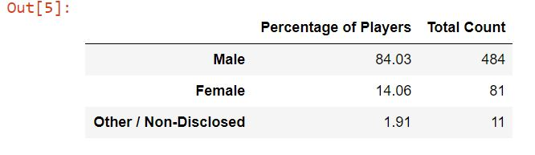

# pandas-challenge
Used Pandas package on [Purchase Data](/Resources/purchase_data.csv) to perform statistical summary.
The raw data was grouped by gender and then by age to see the demographics of the playerbase.
Age bins were created to separate the data into relevant age groups.
The analysis also includes the highest spenders in the dataset as well as most popular items offered by the company.

Screenshots of Analysis:

